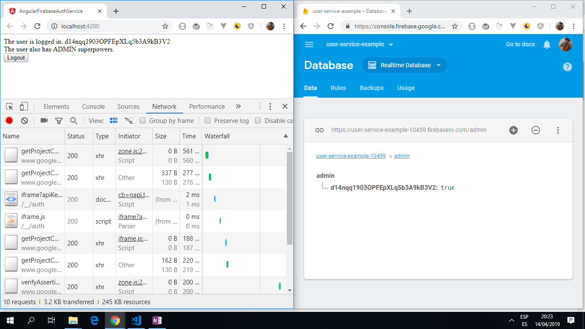

# Angular Firebase Auth Service

Builds a user authentication app using Angular 10 and google Firebase.

*** Note: to open web links in a new window use: _ctrl+click on link_**

## Table of contents

* [Angular Firebase Auth Service](#angular-firebase-auth-service)
  * [Table of contents](#table-of-contents)
  * [General info](#general-info)
  * [Screenshots](#screenshots)
  * [Technologies](#technologies)
  * [Setup](#setup)
  * [Code Examples](#code-examples)
  * [Features](#features)
  * [Status & To-Do List](#status--to-do-list)
  * [Inspiration](#inspiration)
  * [Contact](#contact)

## General info

* Firebase Real-time database used, rules set to test:

```json
{
  "rules": {
    ".read": true,
    ".write": true
  }
}


```

* This is just for development, not production, so the whole firebase module is used. This error is shown in the dev tools console: _When deploying Firebase apps to production, it is advisable to only import the individual SDK components you intend to use._

## Screenshots

.

## Technologies

* [Angular v10](https://angular.io/)
* [Firebase v7](https://firebase.google.com/)
* [Reactive Extensions for Javascript -RxJS v6](https://angular.io/guide/rx-library) library used for reactive programming using the observable type.

## Setup

* Install dependencies with `npm i`
* Create google firebase project and paste access keys into app.module.ts
* Run `ng serve` for a dev server. Navigate to `http://localhost:4200/`. The app will automatically reload if you change any of the source files

## Code Examples

* _user.service_ file

```typescript
@Injectable({
  providedIn: 'root'
})
export class UserService {
  uid = this.afAuth.authState.pipe(
    map(authState => {
      if (!authState) {
        return null;
      } else {
        return authState.uid;
      }
    })
  );
  //test to see if already logged in
  isAdmin: Observable<boolean> = this.uid.pipe(
    switchMap(uid => {
      if (!uid) {
        return observableOf(false);
      } else {
        return this.db.object<boolean>('/admin/' +uid).valueChanges();
      }
    })
  );
  //test to see if user has specific permissions
  constructor(private afAuth: AngularFireAuth, private db: AngularFireDatabase) { }
  login() {
    this.afAuth.auth.signInWithPopup(new auth.GoogleAuthProvider());
  }
  logout() {
    this.afAuth.auth.signOut();
  }
}
```

## Features

* user login using google id or password, can be viewed on Firebase Console.
* User privileges can be revoked from the Firebase console.
* Updated to latest Angular v10 and all dependencies are the latest versions with no conflicts.

## Status & To-Do List

* Status: Updated and working app with a successful login storing login details in the firebase database.
* To-Do: add theme colors and functionality. A bootstrap button would be better.

## Inspiration

* [Demos With Angular: Building A User Authentication Service with Angular and Firebase](https://www.youtube.com/watch?v=mfONkAj4x94).

## Contact

Repo created by [ABateman](https://www.andrewbateman.org) - feel free to contact me!
